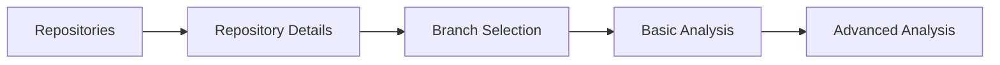

The gitDash dashboard provides an intuitive interface for analyzing GitHub repository contributions. Navigate between repositories, select branches, and run comprehensive analyses to gain insights into team productivity.

## Repository selection

The dashboard starts at the repositories page, where you can view and select from all your GitHub repositories.

### Repositories page

Location: `/dashboard/repositories`

<Info>
The repositories page fetches your GitHub repositories using the authenticated session. Make sure you're signed in with GitHub OAuth.
</Info>

**Features:**
- View all accessible repositories
- Search and filter repositories
- Quick access to repository analysis
- Real-time loading states with error boundaries

**Implementation:**

```tsx components/RepoList.tsx
import { Suspense } from "react";
import { RepoList } from "@/components/RepoList";
import { Spinner } from "@/components/ui/Spinner";

export default function RepositoriesPage() {
  return (
    <ErrorBoundary fallback={<ErrorFallback />}>
      <Suspense fallback={
        <div className="flex items-center justify-center py-12">
          <Spinner size="lg" />
          <p>Loading repositories...</p>
        </div>
      }>
        <RepoList />
      </Suspense>
    </ErrorBoundary>
  );
}
```

## Branch selection

After selecting a repository, you choose which branch to analyze.

### Branch selector component

The `BranchSelector` component displays all available branches with:

<Tabs>
  <Tab title="Main branch">
    The default branch (main/master) is pinned at the top with special styling:
    
    ```tsx
    <div className="bg-gradient-to-r from-orange-100/80 to-sky-100/80">
      <Star className="w-5 h-5 text-orange-600 fill-orange-600" />
      <span>main</span>
      <span className="badge">Default</span>
    </div>
    ```
  </Tab>
  
  <Tab title="Other branches">
    All other branches are listed alphabetically with pagination:
    
    - 10 branches per page
    - Pagination controls
    - Protected branch indicator
    - Commit SHA display
  </Tab>
</Tabs>

**Branch metadata displayed:**

<Card title="Branch information">
  - **Branch name**: The git ref name
  - **Commit SHA**: Latest commit hash (first 7 characters)
  - **Protected status**: Shield icon for protected branches
  - **Default indicator**: Badge showing main/master branch
</Card>

### Branch pagination

```typescript lib/branch-selector.ts
const BRANCHES_PER_PAGE = 10;

const { paginatedBranches, totalPages } = useMemo(() => {
  const startIndex = (currentPage - 1) * BRANCHES_PER_PAGE;
  const endIndex = startIndex + BRANCHES_PER_PAGE;
  const paginated = branches.slice(startIndex, endIndex);
  
  return {
    paginatedBranches: paginated,
    totalPages: Math.ceil(branches.length / BRANCHES_PER_PAGE)
  };
}, [branches, currentPage]);
```

## Analysis dashboard

Once you select a branch, you reach the analysis dashboard where you can configure and run analyses.

### Analysis configuration

Before running analysis, configure these options:

<Accordion title="Since date (optional)">
  Filter commits to only include those after this date.
  
  ```tsx
  <Input
    type="date"
    value={filters.since}
    onChange={e => setFilters({ ...filters, since: e.target.value })}
  />
  ```
</Accordion>

<Accordion title="Until date (optional)">
  Filter commits to only include those before this date.
  
  <Warning>
  The since date must be before the until date. Invalid ranges will show an error.
  </Warning>
</Accordion>

<Accordion title="Filter bot commits">
  Enable this checkbox to exclude automated commits from bots like:
  - dependabot
  - renovate
  - github-actions
  
  Bot detection uses pattern matching on author name and email.
</Accordion>

### Running analysis

Click "Start Analysis" to begin the analysis process:

1. **Connection**: Connects to GitHub API
2. **Fetching**: Retrieves commit data via streaming
3. **Processing**: Analyzes contributions and calculates metrics
4. **Complete**: Displays results with charts and tables

**Progress tracking:**

```typescript
const [progress, setProgress] = useState<ProgressState | null>(null);

// SSE stream processing
if (data.type === "progress") {
  setProgress({
    message: data.message || "Processing...",
    percent: data.percent || 0
  });
}
```

<Info>
Analysis uses Server-Sent Events (SSE) for real-time progress updates. Large repositories may take several minutes.
</Info>

## Navigation between views

### Dashboard navigation flow



### URL structure

- Repositories: `/dashboard/repositories`
- Repository: `/dashboard/repo/[owner]/[repo]`
- Branch analysis: `/dashboard/repo/[owner]/[repo]/branch/[branch]`
- Advanced: `/dashboard/repo/[owner]/[repo]/branch/[branch]/advanced`

### Back navigation

Every analysis page includes a back button:

```tsx
<Link href={`/dashboard/repo/${owner}/${repo}`}>
  <Button variant="gradient" size="sm">
    <ArrowLeft className="w-4 h-4" />
    Back to Branches
  </Button>
</Link>
```

## Dashboard components

### Key UI components

<Card title="RepoList">
  Displays paginated repository list with search and filtering capabilities.
  
  Location: `components/RepoList.tsx`
</Card>

<Card title="BranchSelector">
  Shows available branches with pagination and default branch highlighting.
  
  Location: `components/BranchSelector.tsx`
</Card>

<Card title="ProgressBar">
  Displays real-time analysis progress with gradient styling.
  
  Location: `components/ui/ProgressBar.tsx`
</Card>

<Card title="Spinner">
  Loading indicator with customizable size.
  
  Location: `components/ui/Spinner.tsx`
</Card>

## Error handling

The dashboard implements comprehensive error handling:

<Tabs>
  <Tab title="Error boundaries">
    React Error Boundaries catch component errors:
    
    ```tsx
    <ErrorBoundary fallback={<ErrorFallback />}>
      {/* Components */}
    </ErrorBoundary>
    ```
  </Tab>
  
  <Tab title="API errors">
    Network errors display user-friendly messages:
    
    ```tsx
    if (!response.ok) {
      throw new Error(`Analysis failed with status ${response.status}`);
    }
    ```
  </Tab>
  
  <Tab title="Validation errors">
    Form validation prevents invalid inputs:
    
    ```typescript
    if (sinceDate > untilDate) {
      setAnalysisState({
        status: "error",
        message: "Since date must be before until date"
      });
    }
    ```
  </Tab>
</Tabs>

## Accessibility features

The dashboard follows accessibility best practices:

- **Skip links**: Jump to main content
- **ARIA labels**: Descriptive labels for screen readers
- **Keyboard navigation**: Full keyboard support
- **Loading states**: `aria-live` regions for dynamic content
- **Focus management**: Proper focus indicators

```tsx
<a
  href="#repository-list"
  className="sr-only focus:not-sr-only"
>
  Skip to repository list
</a>
```